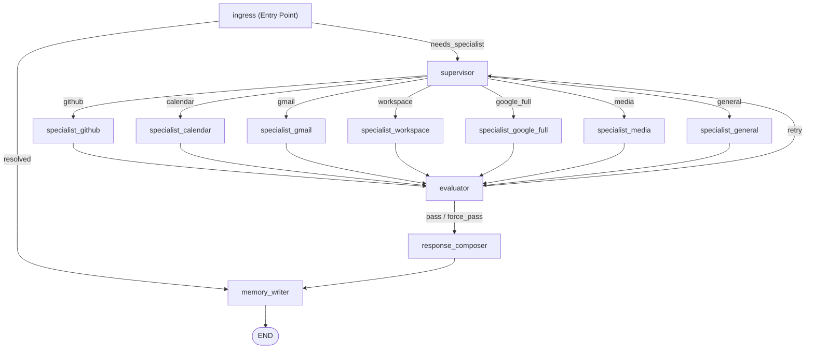

# Agent Graph: LangGraph State Machine

Mia Agent uses a state machine built with LangGraph to orchestrate reasoning, specialist routing, result evaluation, response composition, and memory recording.

---

## 1. Graph Visualization

---

## 2. Node Explanations

### Ingress Node (`ingress`)
The entry point of the graph. It performs lightweight, fast operations:
1. **Approval Checking**: Inspects if the user's input is a confirmation for a pending action.
2. **Follow-up Routing**: Matches natural language cues to determine if the query is a follow-up about a recently analyzed URL, document, or GitHub repository. GitHub follow-ups now include repo overview, README, tree, branch, release, pull request, and issue drill-down.
3. **Direct Path Execution**: Evaluates if the query can be resolved directly without generating an agent plan. This includes low-side-effect requests like memory_recent, weather, news, gold, search_web, read_url, summarize_url, ask_url, shortlink, and time_now.

If the request is resolved in Ingress, the graph bypasses the agent loop and moves directly to `memory_writer`. Otherwise, it transitions to `supervisor`.

### Supervisor Node (`supervisor`)
Prepares the state payload for the specialized agent. It:
1. Gathers context, history, and metadata.
2. Injects domain-specific guidance (e.g., Gmail guidance).
3. Injects self-improvement feedback insights retrieved from the learning repository.
4. Routes the request to one of 7 specialist nodes.

### Specialist Nodes
Each specialist is a LangChain agent running with a subset of tools configured for that domain:
- `specialist_github`: For code reading, diff analysis, repo search, release, pull request, and issue drill-down.
- `specialist_calendar`: Calendar events management.
- `specialist_gmail`: Inbox viewing, search, drafting, reply.
- `specialist_workspace`: Drive, Docs, Sheets management.
- `specialist_google_full`: Orchestrator when multi-step google tools are needed.
- `specialist_media`: Handles OCR, file summary, speech transcribing.
- `specialist_general`: General conversational agent.

### Evaluator Node (`evaluator`)
Ensures output quality by inspecting the specialist agent's run:
- Validates if the agent used correct tools and parameters.
- For GitHub and web-style specialist responses, missing tool evidence is treated as a fail so the graph does not bless unsupported answers.
- Analyzes if the response is complete or requires corrections.
- If validation fails, it triggers a `retry` transition back to `supervisor` with system guidance detailing the error. The system supports up to 2 retries.
- If it passes, it goes to `response_composer`.

### Response Composer Node (`response_composer`)
Formulates the final conversational message:
- Sanitizes the output text (removes trailing think blocks, fixes links formatting).
- Attaches relevant tool links.
- Recovers URL tags suitable for Telegram client.

### Memory Writer Node (`memory_writer`)
Records the conversation details:
- Gathers learning event metadata.
- Persists user query, tool logs, final text, and model tokens usage to database.
- Writes new semantic rules if needed.
